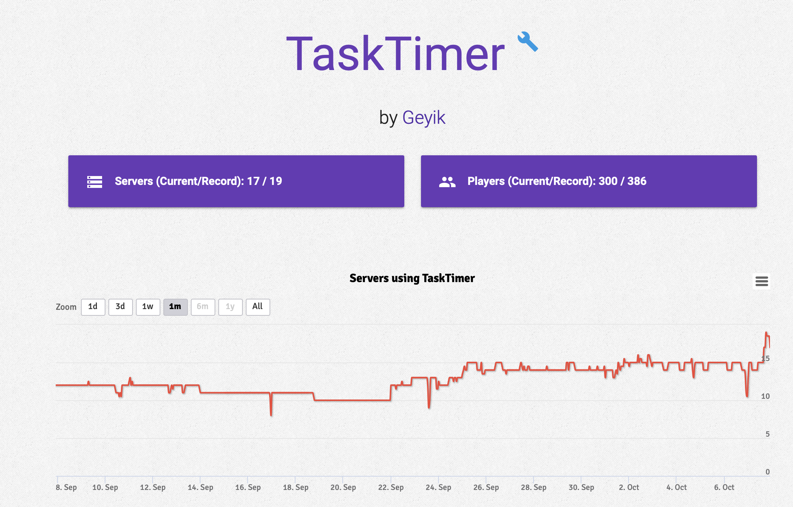

> `This project discounted atm.`

> This is premium resource of TaskTimer usage information. You can check premium one: [BuiltByBit](https://builtbybit.com/resources/tasktimer-schedule-automated-commands.25268/)

### [Click for current usage](https://bstats.org/plugin/bukkit/TaskTimer/16351)

# TaskScheduler

TaskScheduler is a type of scheduling plugin. It assists you in running one or more commands at a specified time on a specific day (days of the week: SUN, MON, TUE, etc.) or every day of the week at the specified hour.

## Configuration file

  
config.yml

    # You have to open HaveDate setting if you want to use it only one day.
    Tasks:
    0:
        Time: '22:04:00'
        HaveDate: true
        Day: 'Mon'
        Command:
        - 'say This is a task for 22:04:00 only for Monday'
    1:
        Time: '22:04:05'
        HaveDate: false
        Day: ''
        Command:
        - 'say This is a task for 22:04:05 every day'

## Contributing

We welcome contributions from the community! If you would like to contribute, please follow these guidelines:

1. Fork the repository and clone it to your local machine.
2. Create a new branch for your feature or bug fix.
3. Make your changes, and ensure that your code is well-tested.
4. Create a pull request with a detailed description of your changes.

By contributing to this project, you agree to abide by the [Code of Conduct](CODE_OF_CONDUCT.md).